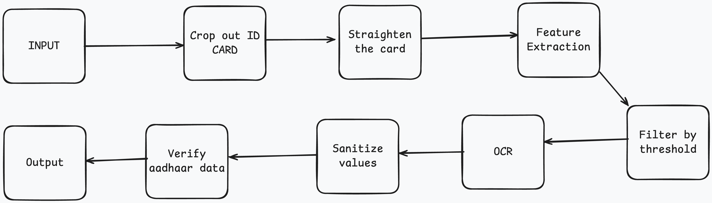

# Aadhaar OCR

This project provides a solution for extracting and processing data from Aadhaar cards using Optical Character Recognition (OCR). It leverages computer vision models to detect, recognize, and extract key information fields from scanned or photographed Aadhaar cards, such as name, address, date of birth, and Aadhaar number. The project is designed to streamline the automated handling of Aadhaar cards for applications where identity verification and data extraction are required. <br />

<small>Source: A very well known LLM</small>

## Process


## Getting Started

1. Create virtual environment
```sh
python3 -m venv .venv
```

2. Activate the vritual environment (unix-like os)
```sh
source ./.venv/bin/activate
```

3. Install Dependencies
```sh
pip install -r requirements.txt
```

4. Run the server (dev mode)
```sh
fastapi dev api.py
```

## Api
1. POST `/aadhaar/ocr`

**Request**
```json
{
    "front": "base64 front of aadhaar card",
    "back": "base64 back of aadhaar card"
}
```

**Response (200)**
```json
{
    "name": "string",
    "date_of_birth": "string",
    "gender": "string",
    "aadhaar_number": "string",
    "address": "string"
}
```

## Dataset
https://universe.roboflow.com/adhaar-field-detection/adhaar_card_field_detection_pro/dataset/1
